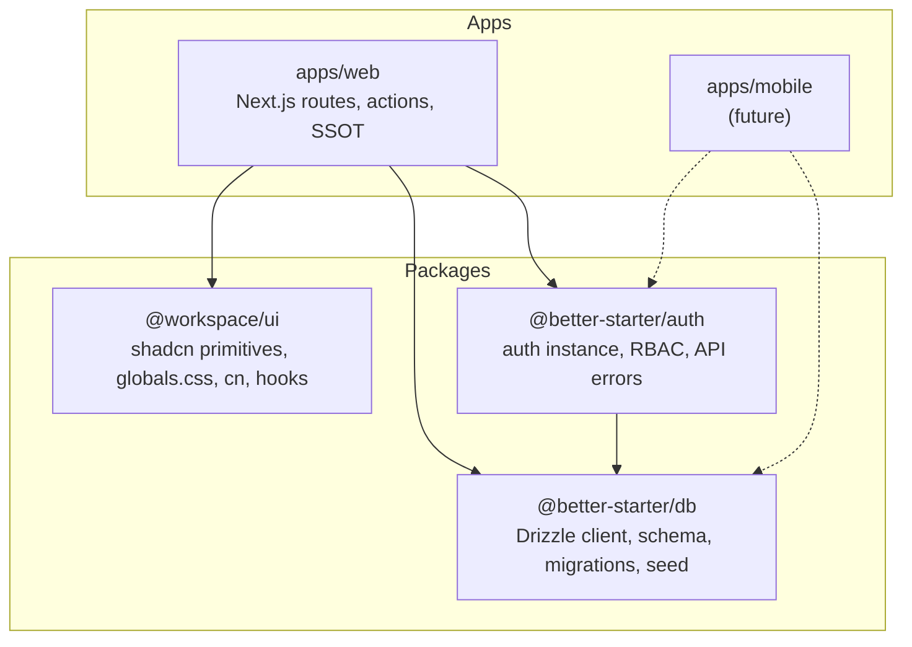
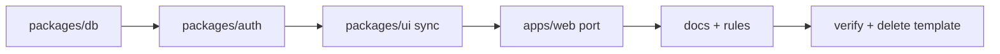

# مهاجرت better-dashboard-template به مونوریپو

## وضعیت فعلی

| لایه                                                               | وضعیت                                                        |
| ------------------------------------------------------------------ | ------------------------------------------------------------ |
| [`apps/better-dashboard-template`](apps/better-dashboard-template) | اپ کامل — auth، db، dashboard، ۵۳ کامپوننت UI محلی           |
| [`apps/web`](apps/web)                                             | اسکلت خالی — فقط یک صفحه placeholder                         |
| [`packages/ui`](packages/ui)                                       | ۵۸ کامپوننت shadcn — **بدون theme CSS کامل** (فقط `@source`) |
| `packages/auth`, `packages/db`                                     | **وجود ندارند** — فقط در docs برنامه‌ریزی شده                |

**تضاد doc vs intent:** [`AGENTS.md`](AGENTS.md) می‌گوید UI per-app؛ شما می‌خواهید الگوی **shadcn monorepo / turbo-starter** — UI primitives در `packages/ui`، کامپوننت‌های app-specific در خود اپ. این تصمیم جدید در docs اعمال می‌شود.

---

## معماری هدف



### مرز مسئولیت‌ها

| محل                 | مالکیت                                                                                                                                                                            |
| ------------------- | --------------------------------------------------------------------------------------------------------------------------------------------------------------------------------- |
| **`packages/ui`**   | فقط shadcn/Base UI primitives (`button`, `sidebar`, …)، `globals.css` + theme tokens، `cn()`، `use-mobile` — چیزهایی که بین web/mobile/extension مشترک‌اند                        |
| **`packages/db`**   | `db` client، `auth.schema.ts` (generated)، migrations، seed scripts، drizzle config                                                                                               |
| **`packages/auth`** | `auth` instance + plugins، `admin-access` / `organization-access`، `getAuthApiErrorMessage`، redirect helpers بدون وابستگی Next                                                   |
| **`apps/web`**      | routes، layouts، Server Actions، SSOT (`cache-tags.ts`, `*-routes.ts`)، session helpers مخصوص Next (`headers()` / `redirect`)، dashboard chrome، `badge/`، `data-table/`، `form/` |

**قانون طلایی:** اگر فقط web ازش استفاده می‌کند → در `apps/web`. اگر mobile/extension هم می‌تواند استفاده کند → package.

---

## فاز ۱ — `packages/db`

ایجاد [`packages/db/`](packages/db/) با ساختار:

```
packages/db/
├── src/
│   ├── client.ts          ← از template src/lib/db.ts
│   └── schema/
│       └── auth.schema.ts ← از template src/db/auth.schema.ts
├── drizzle/               ← migrations موجود
├── scripts/
│   ├── patch-auth-schema-pg.mjs
│   └── seed-dev/          ← از template scripts/seed-dev/
├── drizzle.config.ts
└── package.json           ← name: "@better-starter/db"
```

**Exports:**

```json
{
  ".": "./src/client.ts",
  "./schema": "./src/schema/auth.schema.ts"
}
```

**Scripts (در package):** `auth:generate`, `db:generate`, `db:migrate`, `db:push`, `db:studio`, `seed:dev`, `seed:dev:clear`

- `auth:generate` به config جدید اشاره می‌کند: `--config ../../packages/auth/src/auth.ts --output ./src/schema/auth.schema.ts`
- env: `DATABASE_URL` از root `.env` یا `apps/web/.env.local` (via dotenv در drizzle config)

---

## فاز ۲ — `packages/auth`

ایجاد [`packages/auth/`](packages/auth/) با:

```
packages/auth/src/
├── auth.ts              ← از template (import db از @better-starter/db)
├── admin-access.ts
├── organization-access.ts
├── auth-api-error.ts
├── redirect.ts          ← normalizeAuthRedirectTarget, buildAuthRouteWithRedirect (بدون Next)
└── index.ts             ← re-export auth + helpers
```

**عمداً خارج از package:**

- [`session.ts`](apps/better-dashboard-template/src/lib/auth/session.ts) — وابسته به `next/headers`, `next/navigation`, و `auth-routes` اپ → می‌ماند در `apps/web/src/lib/auth/session.ts`
- [`dashboard-session.ts`](apps/better-dashboard-template/src/app/dashboard/lib/dashboard-session.ts) — Next-specific → `apps/web/src/app/dashboard/lib/`

**وابستگی:** `@better-starter/db`, `better-auth`, `drizzle-orm` (peer/transitive via db)

---

## فاز ۳ — هم‌تراز کردن `packages/ui`

[`packages/ui`](packages/ui) از قبل shadcn monorepo setup دارد ([`components.json`](packages/ui/components.json) → `@workspace/ui/components`).

**کارهای لازم:**

1. **Theme CSS:** محتوای [`apps/better-dashboard-template/src/app/globals.css`](apps/better-dashboard-template/src/app/globals.css) (theme tokens, `@theme inline`, dark variant) را به [`packages/ui/src/styles/globals.css`](packages/ui/src/styles/globals.css) منتقل کن — `@source` directives برای scan کردن `apps/**` حفظ شود.

2. **هم‌ترازی کامپوننت‌ها:** template و package تفاوت دارند (مثلاً `drawer` در template از `vaul`، در package از Base UI). برای «همان استایل دقیق»:
   - template `src/components/ui/*` را source of truth بگیر
   - importها را به `@workspace/ui/lib/utils` تبدیل کن
   - در `packages/ui` جایگزین کن
   - deps گم‌شده (`vaul` اگر لازم) را به [`packages/ui/package.json`](packages/ui/package.json) اضافه کن

3. **apps/web `components.json`:** از قبل درست است — aliases به `@workspace/ui` اشاره می‌کنند؛ app components در `@/components`.

---

## فاز ۴ — پورت به `apps/web`

ساختار [`apps/web`](apps/web) را به الگوی template با `src/` تبدیل کن:

```
apps/web/
├── src/
│   ├── app/                    ← کل tree از template (auth, dashboard, action, layout, page)
│   ├── components/             ← badge/, data-table/, form/, theme-provider, … (نه ui/)
│   ├── lib/
│   │   ├── auth/session.ts     ← Next session (import auth از @better-starter/auth)
│   │   ├── badge/, data-table/
│   │   └── format-date.ts
│   └── hooks/                  ← فقط اگر hook app-specific باشد
├── components.json
├── next.config.ts              ← reactCompiler, cacheComponents, transpilePackages
├── drizzle.config.ts           ← thin re-export یا script alias به @better-starter/db
└── package.json
```

**نقشه import rewrite (اصلی‌ترین‌ها):**

| قبل (template)                 | بعد (web)                                       |
| ------------------------------ | ----------------------------------------------- |
| `@/components/ui/*`            | `@workspace/ui/components/*`                    |
| `@/lib/utils`                  | `@workspace/ui/lib/utils`                       |
| `@/hooks/use-mobile`           | `@workspace/ui/hooks/use-mobile`                |
| `@/lib/auth/auth`              | `@better-starter/auth`                          |
| `@/lib/auth/admin-access` etc. | `@better-starter/auth`                          |
| `@/lib/db`                     | `@better-starter/db`                            |
| `@/db/auth.schema`             | `@better-starter/db/schema`                     |
| `@/lib/auth/session`           | `@/lib/auth/session` (همان مسیر، محتوای به‌روز) |

**چیزهایی که بدون تغییر منطقی کپی می‌شوند:**

- کل `src/app/` شامل `action/`, `dashboard/lib/cache-tags.ts`, `dashboard-routes.ts`, …
- `src/components/` (غیر از `ui/` که حذف می‌شود)
- `next.config.ts` options از template
- babel react-compiler، prettier، eslint-config-next

**Dependencies در `apps/web/package.json`:**

- workspace: `@workspace/ui`, `@better-starter/auth`, `@better-starter/db`
- runtime: `next`, `react`, `better-auth`, `next-themes`, `ua-parser-js`, …
- dev: `drizzle-kit`, `@types/pg`, `babel-plugin-react-compiler`

**Env:** `.env.example` در root یا `apps/web/` با `DATABASE_URL`, `BETTER_AUTH_URL`, `NEXT_PUBLIC_BETTER_AUTH_URL`

---

## فاز ۵ — Turbo و root wiring

- [`turbo.json`](turbo.json): اضافه کردن taskهای db (`db:migrate`, `seed:dev`) اگر لازم
- [`pnpm-workspace.yaml`](pnpm-workspace.yaml): بدون تغییر (`apps/*`, `packages/*`)
- Root scripts: `pnpm --filter web dev`, `pnpm --filter @better-starter/db db:migrate`
- حذف placeholder [`apps/web/app/`](apps/web/app/) و [`apps/web/components/`](apps/web/components/) قدیمی بعد از پورت `src/`

---

## فاز ۶ — Agent docs و cursor rules

**به‌روزرسانی در سطح مونوریپو** (نه کپی خام template):

| فایل                                                         | تغییر                                                                                  |
| ------------------------------------------------------------ | -------------------------------------------------------------------------------------- |
| [`AGENTS.md`](AGENTS.md)                                     | UI = `@workspace/ui` برای primitives؛ app components در `apps/<app>/src/components/`   |
| [`docs/agents/monorepo.md`](docs/agents/monorepo.md)         | اضافه کردن `packages/ui` به layout؛ حذف «UI per app»                                   |
| [`docs/agents/ui-design.md`](docs/agents/ui-design.md)       | shadcn CLI: `pnpm dlx shadcn@latest add button -c packages/ui`؛ app aliases به package |
| [`docs/agents/architecture.md`](docs/agents/architecture.md) | search-up: `src/components/` قبل از `@workspace/ui`؛ session Next در app               |
| [`docs/agents/better-auth.md`](docs/agents/better-auth.md)   | paths واقعی packages/auth + session در app                                             |
| [`.cursor/rules/*.mdc`](.cursor/rules/)                      | هم‌تراز با docs جدید                                                                   |

**حذف بعد از migration:**

- `apps/better-dashboard-template/` (کل directory)
- duplicate docs/rules داخل template

---

## فاز ۷ — اعتبارسنجی و cleanup

```bash
pnpm install
pnpm --filter @better-starter/db db:migrate   # یا db:push در dev
pnpm typecheck
pnpm build
pnpm --filter web dev
```

**چک‌لیست دستی:**

- `/login`, `/signup`, `/dashboard`, admin, account, org manage
- mutations + cache invalidation (`updateTag`)
- dark mode + RTL (`DirectionProvider`)
- seed:dev برای dev data

---

## ترتیب اجرا (پیشنهادی)



هر فاز commit جداگانه (اگر بخواهید) — قابل review مرحله‌ای.

---

## ریسک‌ها و نکات

- **UI diff:** package و template در برخی کامپوننت‌ها (drawer, button variants) متفاوتند — فاز ۳ critical است برای «همان استایل»
- **globals.css:** بدون theme tokens کامل، dashboard sidebar/theme خراب می‌شود
- **Session در app نه package:** با [`docs/agents/better-auth.md`](docs/agents/better-auth.md) § Mobile سازگار است — mobile بعداً client خودش را دارد
- **Naming:** `@workspace/ui` فعلاً نگه داشته می‌شود (مثل turbo-starter scaffold)؛ rename به `@better-starter/ui` optional و خارج از scope این migration
- **No API route:** template از server actions + `nextCookies()` استفاده می‌کند — همین الگو حفظ می‌شود
